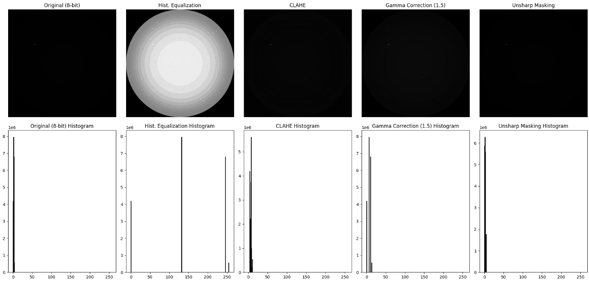
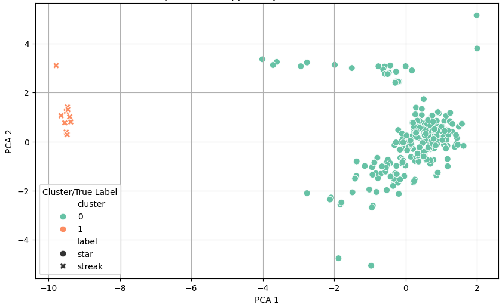
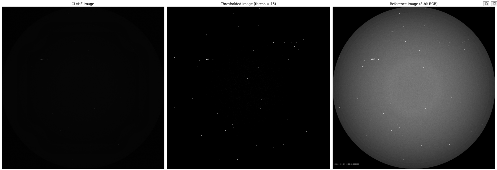
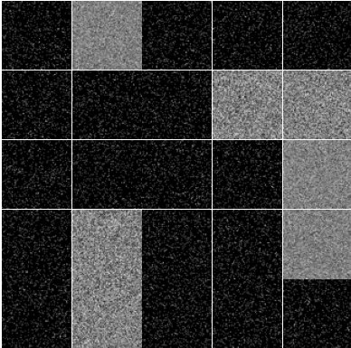
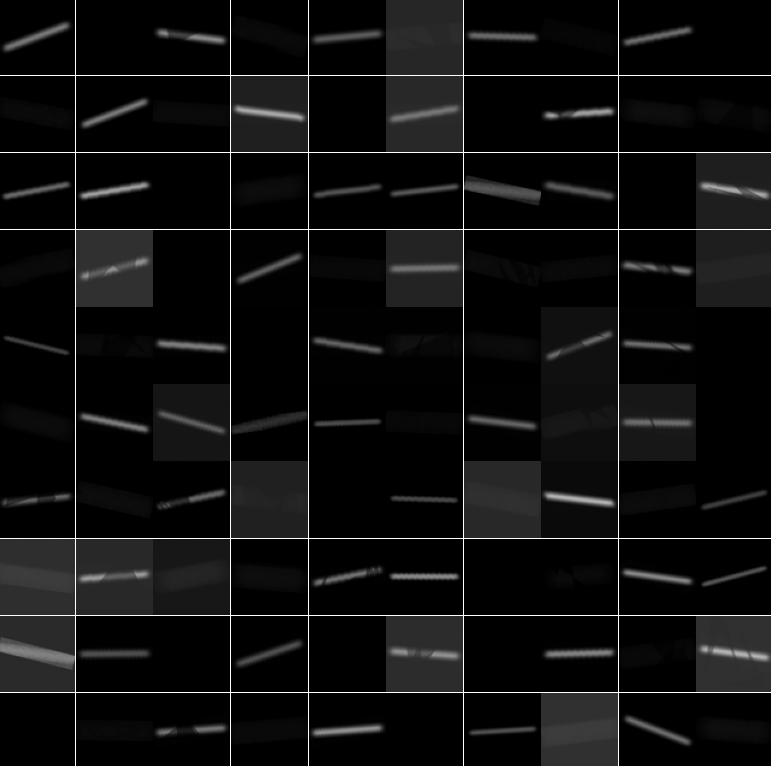
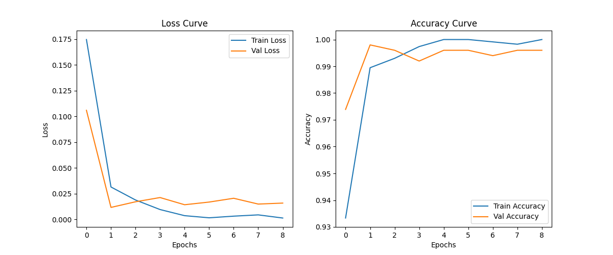
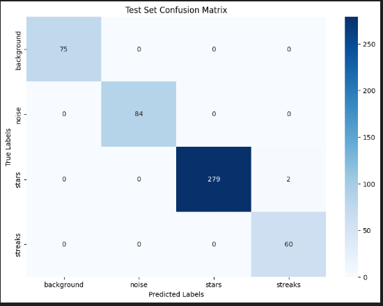
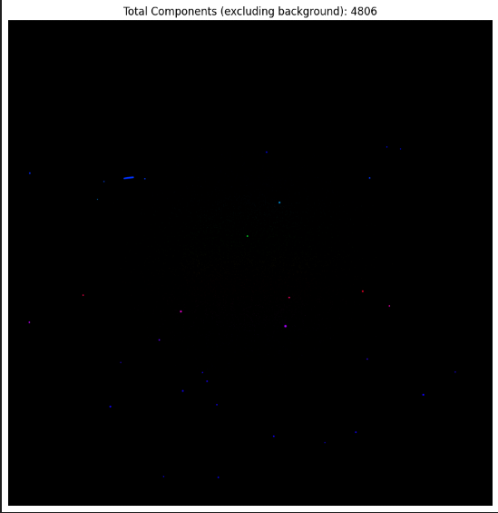
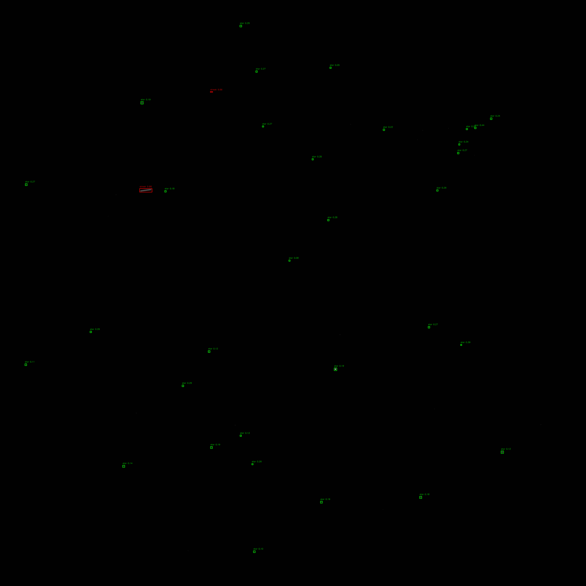

# Streak and Star Detection using Image Processing

## Overview

This project focuses on detecting **streaks** and **stars** in synthetic astronomical images using image processing techniques. The goal is to extract meaningful binary masks and object statistics that can be used to detect and classify the astronomical objects.

---

## ENHANCEMENT

The following preprocessing steps are applied to the raw `.tiff` images before classification:

### Step 1: Load and Normalize 16-bit TIFF Images

Each image is initially loaded in 16-bit grayscale format and normalized to 8-bit to ensure compatibility with standard OpenCV operations.

### Step 2: Bilateral Filtering

A bilateral filter is applied to smooth the image while preserving edges. This helps suppress noise without blurring important features like star points or streak edges.

### Step 3: Contrast Enhancement using CLAHE

Contrast Limited Adaptive Histogram Equalization (CLAHE) is used to enhance local contrast in dim regions of the image.

---
### Comparison of image enhancement methods




## EDGE DETECTION AND SEGMENTATION

A custom threshold is selected using the median of the cumulative histogram. This ensures the binarization adapts to image content dynamically.

### Sample

| Original                             | Enhanced                              | Binary Mask                        |
| ------------------------------------ | ------------------------------------- | ---------------------------------- |
|  |  |  |

After preprocessing, each binary image is analyzed to extract and classify individual objects (stars and streaks). The classification is based on **eccentricity** and object proximity.

### Classification Logic

* **Eccentricity < 0.9** → Classified as **Star** (typically round, green box)
* **Eccentricity ≥ 0.9** → Classified as **Streak** (typically elongated, red box)
* **Minimum area** threshold = 75 pixels
* **Minimum centroid distance** = 10 pixels (to prevent duplicate detections)

### Steps

1. **Connected Components** are grown using morphological operations and then extracted using `skimage.measure.label` and `regionprops`.
2. Each valid object (area ≥ 75) is filtered based on centroid distance to avoid duplicates.
3. Bounding boxes are drawn and labeled with eccentricity and type (star/streak).
4. Cropped object images are saved separately into:

   * `stars-images/` for stars
   * `streaks-images/` for streaks

Two CSV files are generated:

* `eccentricity_data.csv` – contains per-object statistics
* `image_stats.csv` – summary of total stars and streaks per image

Each object is also logged with a set of features that can be used for visualizing the inter-class variance:

```python
features = {
    'file': image_path.name,
    'label': label,  # "star" or "streak"
    'aspect_ratio': aspect_ratio,
    'area': area,
    'eccentricity': eccentricity
}
```

---

## Clustering

* Use **KMeans** clustering with `n_clusters=2` (expecting two natural groups: stars vs. streaks).
* Assign the predicted cluster to a new `cluster` column.

### Visualization

* Scatter plot with:

  * `pca1` and `pca2` as axes.
  * Point color representing **cluster assignment**.
  * Point style showing **true labels** (`star` or `streak`) for comparison.



---

## DATASET

1. The segmented objects were:

   * Thresholded
   * Cropped from original image

   These were padded to 128x128 and used for classification.

   

2. Artificial noise and artifacts were introduced since background information was not included.

   

3. Dataset was augmented to balance the streak-star bias.

   

---

## Model Training

* All models were trained with **Faster R-CNN** architecture and **ResNet-18** for feature representation.
* Achieved over 99% accuracy, indicating overfitting on the small dataset.



---

## Evaluation

* Confusion matrix plotted for final trained model:

  

* Total number of components (stars + streaks) per image:

  

---

## Annotation Demo

* Annotated image visualizations:

  

---

## Directory Structure

```bash
StreakStarDetection/
├── data/                 # Raw TIFF images
├── notebooks/            # Jupyter notebooks for processing and training
├── models/               # Trained model files (if available)
├── src/
│   ├── preprocessing.py  # Image enhancement & filtering
│   ├── segment.py        # Thresholding & morphological ops
│   ├── features.py       # Eccentricity calculation
│   ├── train_model.py    # Model training
│   └── evaluate.py       # Evaluation & metrics
├── images/               # Visual output samples
├── README.md
└── requirements.txt
```
