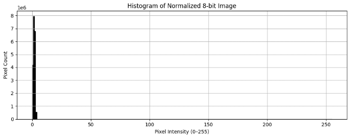
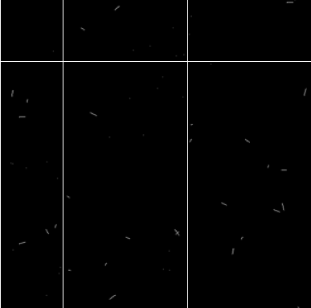
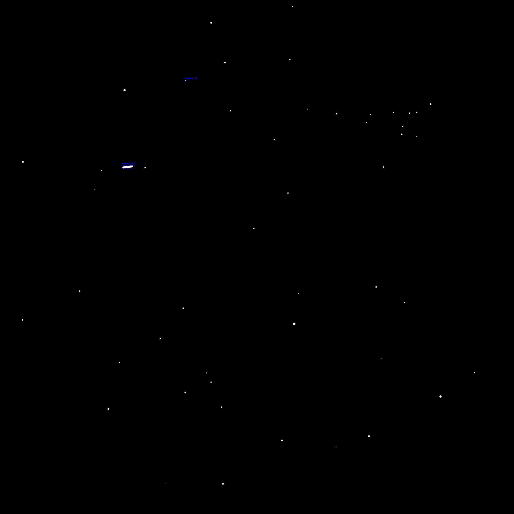

# Streak and Star Detection using Image Processing

## Overview

This project focuses on detecting **streaks** and **stars** in synthetic astronomical images using image processing techniques. The goal is to extract meaningful binary masks and object statistics that can be used to detect and classify the astronomical objects using deep learning.

The first step is do introduce labels for the dataset which is accomplished by the image processing pipeline following which an object detection model based on Faster RCNN architecture with resnet18 as the feature extractor.

---
## Performance Demo

* model visualizations:
   

  


---
### Image processing

## ENHANCEMENT

The following preprocessing steps are applied to the raw `.tiff` images before classification:

### Step 1: Load and Normalize 16-bit TIFF Images

Each image is initially loaded in 16-bit grayscale format and normalized to 8-bit to ensure compatibility with standard OpenCV operations.

### EDA



### Step 2: Bilateral Filtering

A bilateral filter is applied to smooth the image while preserving edges. This helps suppress noise without blurring important features like star points or streak edges.

### Step 3: Contrast Enhancement using CLAHE

Contrast Limited Adaptive Histogram Equalization (CLAHE) is used to enhance local contrast in dim regions of the image.

---
### Comparison of image enhancement methods


## EDGE DETECTION AND SEGMENTATION

A custom threshold is selected using the median of the cumulative histogram. This ensures the binarization adapts to image content dynamically.

### Sample
Side by side comparison of Processed image and reference image


After preprocessing, each binary image is analyzed to extract and classify individual objects (stars and streaks). The classification is based on **eccentricity** and object proximity.

### Classification Logic

* **Eccentricity < 0.9** → Classified as **Star** (typically round, green box)
* **Eccentricity ≥ 0.9** → Classified as **Streak** (typically elongated, red box)
* **Minimum area** threshold = 75 pixels
* **Minimum centroid distance** = 10 pixels (to prevent duplicate detections)

### visualizing components


### Steps

1. **Connected Components** are grown using morphological operations and then extracted using `skimage.measure.label` and `regionprops`.
2. Each valid object (area ≥ 75) is filtered based on centroid distance to avoid duplicates.
3. Bounding boxes are drawn and labeled with eccentricity and type (star/streak).
4. Cropped object images are saved separately into:

   * stars `stars-images/`  for raw image, `Data\Dataset_Raw_Augment_Noise\stars` augmented and padded
   * streaks `streaks-images/`  for raw image, `Data\Dataset_Raw_Augment_Noise\streaks` augmented and padded

Two CSV files are generated:

* `eccentricity_data.csv` – contains per-object statistics
* `image_stats.csv` – summary of total stars and streaks per image

Each object is also logged with a set of features that can be used for visualizing the inter-class variance:

```python
features = {
    'file': image_path.name,
    'label': label,  # "star" or "streak"
    'aspect_ratio': aspect_ratio,
    'area': area,
    'eccentricity': eccentricity
}
```

---

## Clustering

* Use **KMeans** clustering with `n_clusters=2` (expecting two natural groups: stars vs. streaks).
* Assign the predicted cluster to a new `cluster` column.
* This is done to visualize the clear difference in feature repressentation of stars and streaks

### Visualization

* Scatter plot with:

  * `pca1` and `pca2` as axes.
  * Point color representing **cluster assignment**.
  * Point style showing **true labels** (`star` or `streak`) for comparison.


---

## DATASET

# For the object detection task, the images are augmented to improve generalizablility, further to reduce bias towards stars over streaks caused by stark difference in dataset size, 
   1. Weighted classes were used
   2. Undersampling of stars were done
   3. Additional augments of streaks were added

   The Dataset is tiled to
      512 x 512 size images since the fasterRCNN class in pytorch resizes the images to approx 800x800 which would ressult in a lot of information loss if we use the original 4500x4500 image(padded) 
      128x128 tiles were also experimented with


1. The segmented objects were:

   * Thresholded
   * Cropped from original image

   These were padded to 128x128 and used for classification.

   

2. Artificial noise and artifacts were introduced since background information was not included.
    
    NOISE CLASS - containing gaussian, salt and pepper, normal 

   

   BACKGROUND CLASS - artifacts, dead/hot pixel, cosmic rays

   

3. Dataset was augmented to balance the streak-star bias.

   

---

## Model Training

* All models were trained with **Faster R-CNN** architecture and **ResNet-50** for feature representation.

* Object Detection Results:


at Patch size 512x512 streaks were clearly detection with precision 
at patch size 128x128 streaks and stars are estimated to be detected  

As the reference images, streaks seperately highlighted




---
 * classification task results:


* Confusion matrix plotted for final trained model:

  

---


## Installation guide will be released soon
